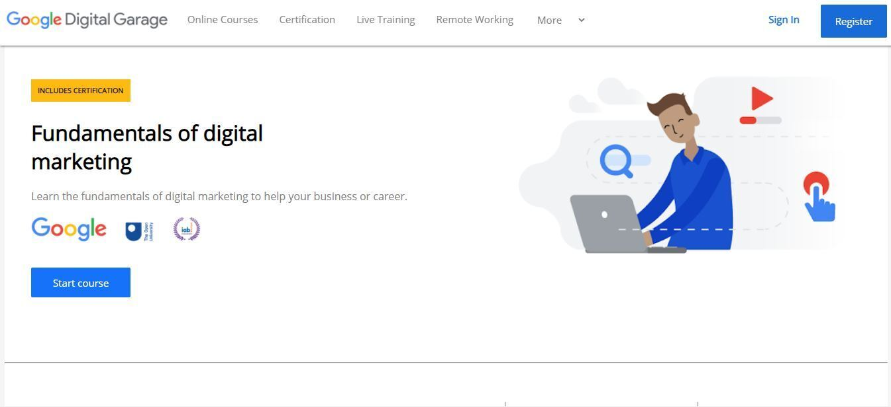
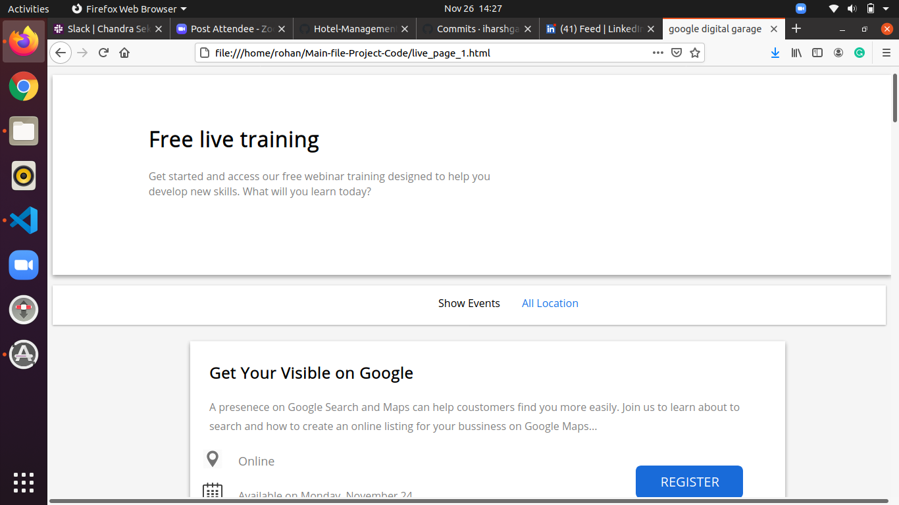
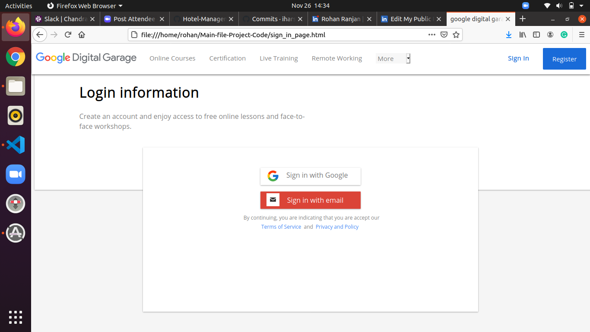

# Google Digital Garage clone
This repository is for developing the Google Digital Garage clone.

# What is Google Digital Garage?
Google Digital Garage is a Grow with Google programme that provides free training and tools to help grow your career or business in the UK. Since 2015, the Google Digital Garage has visited more than 500 locations across the UK, and trained more than 400,000 people.

## Tech Stacks Used:
 
- **HTML**
- **CSS**
- **JavaScript**

### **Index Page:**

Overview of the Google Digital Garage - online courses, certification, live training and remote working.
This Website provides online training and courses.

### **Online Course:**

An online course is the delivery of a series of lessons on a web browser or mobile device, which can be accessed anytime and anyplace. You can learn by selecting individual modules, or dive right in and take an entire course end to end. It is designed as an online environment for convenient learning asynchronously.

### **Certification:**

Learn job-ready skills to start or advance your career in high-demand fields. These certificates developed by Google Digital Garage you to top national employers who are hiring for certain roles.

### **live training:**

Attend a Grow with Google Digital Garage training Join us for free workshops including virtual options to grow your skills, career or business.

### **Remote Working:**

In today's environment, more employees, educators, and students are working remotely. To help, we’ve gathered some tools and resources you can use to stay connected and productive.
"Helping you work, teach and learn from anywhere"

### **Sign In:**

### **Registration:**

 👤 **MD Amanullah**

- Github: [MD Amanullah](https://github.com/Amanullah21)
- Linkedin: [MD Amanullah
](https://www.linkedin.com/mwlite/in/md-amanullah-0239691798)

👤 **Harsh Gaur**

- Github: [iharshgaur](https://github.com/iharshgaur)
- Linkedin: [Harsh Gaur](https://www.linkedin.com/in/harsh-gaur-099849142/)

👤 **Rohan Ranjan**

- Github: [rohanranjan25061996](https://github.com/rohanranjan25061996)
- Linkedin: [Rohan Ranjan](www.linkedin.com/in/rohan-ranjan-3a3048130)
